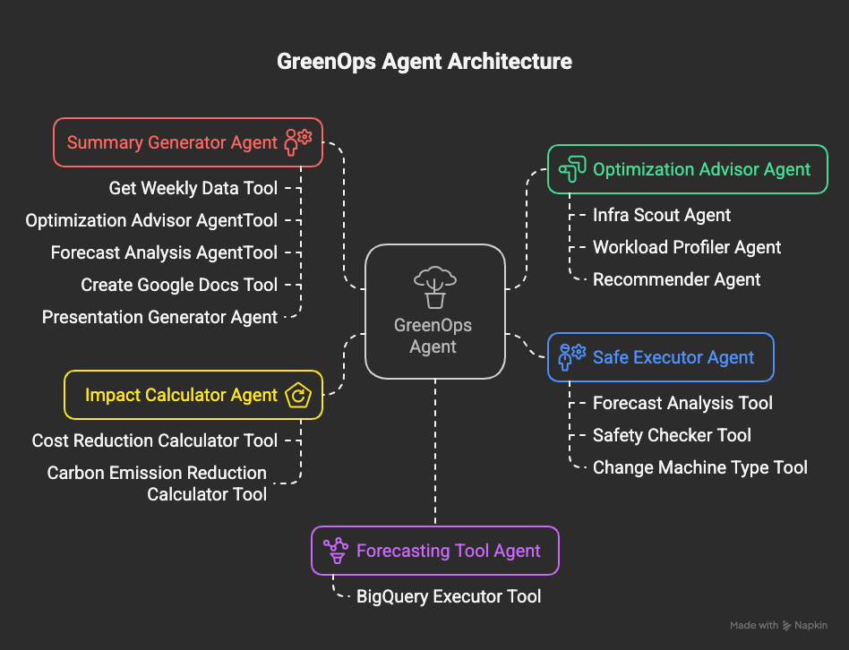
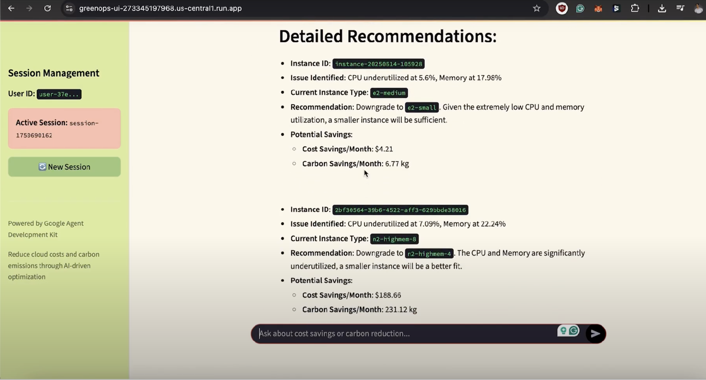
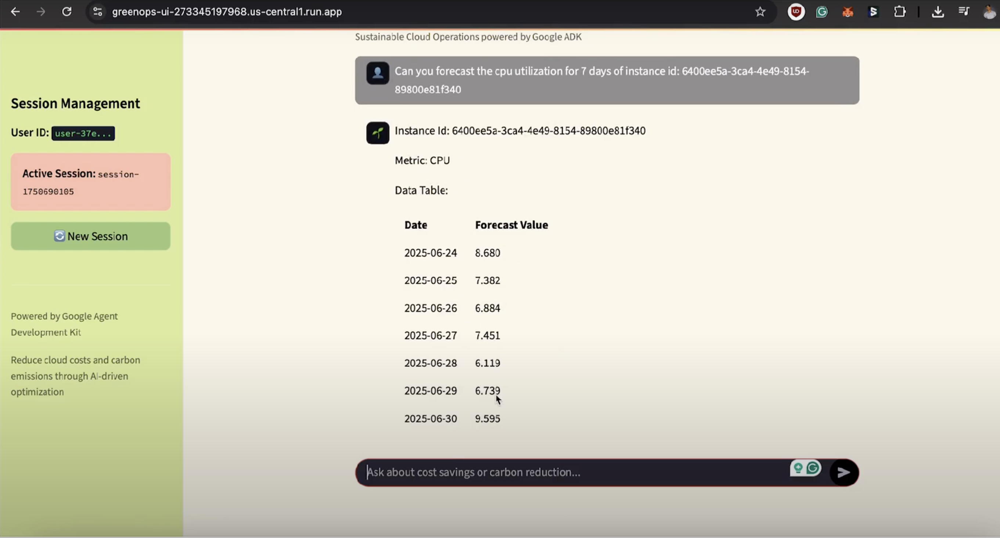
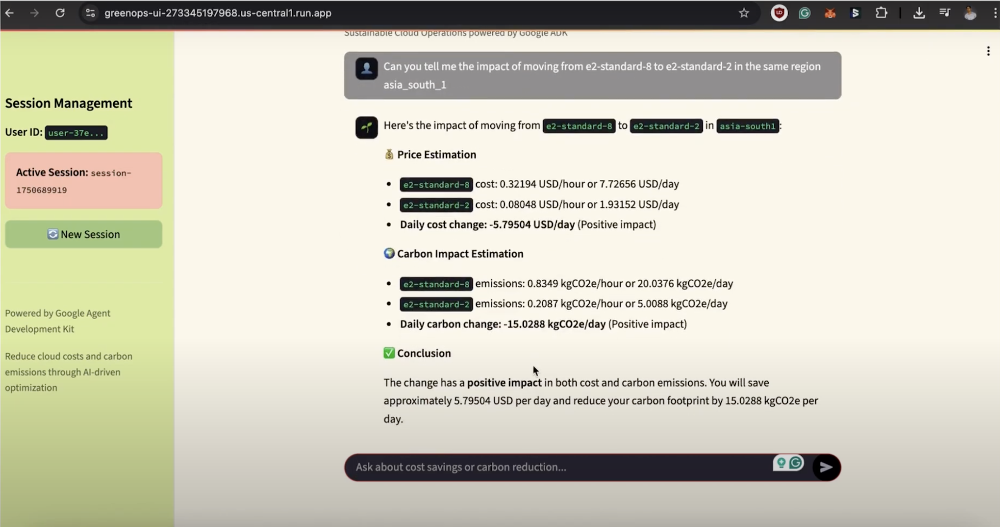
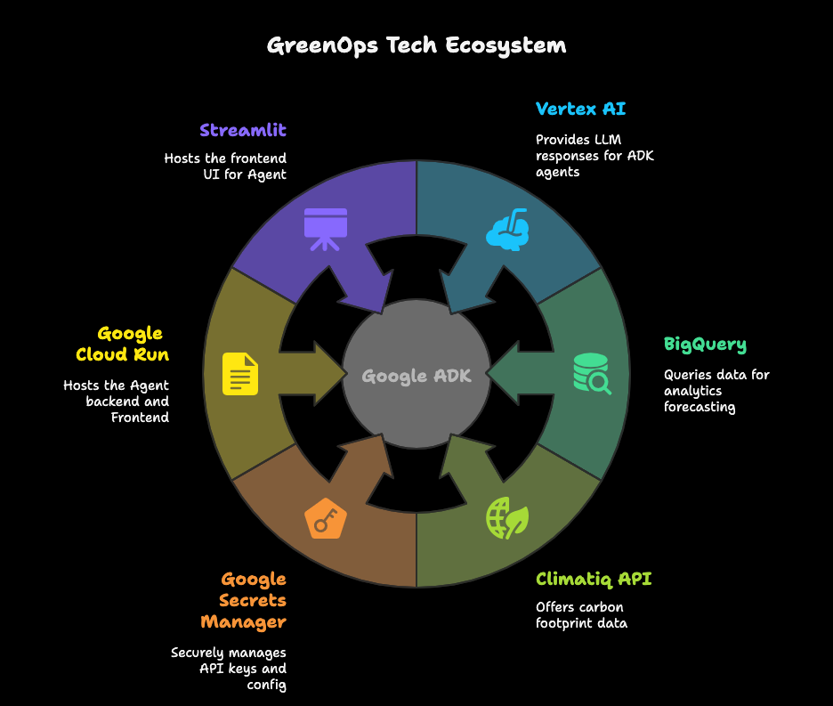

## Inspiration
Cloud waste isn’t just a cost problem—it’s a **carbon problem**. While working with GCP environments, we discovered that teams often over-provision resources "just to be safe," leading to **sky-high bills and unnecessary CO₂ emissions**. Worse, optimizing manually is slow and error-prone.  

We built **GreenOps** to automate sustainability. Our vision: **an AI team that continuously audits, forecasts, and optimizes cloud infrastructure**

## What it does

Imagine typing a question like:

> *“How can I reduce cost and emissions in us-central1?”*

GreenOps activates. Here’s what happens:

* The **GreenOps Agent**, our commander-in-chief, kicks into action.
* It routes the query to a sequence of **expert sub-agents**—each trained for a precise role: scout, analyze, recommend, forecast, automate, summarize.
* Within moments, you get:
  * Detailed infrastructure recommendations
  * Forecasted resource + carbon usage
  * Execution plan (if it’s safe)
  * Weekly report in **Google Docs**
  * Downloadable **Presentation deck**

## 🧠 How Each Agent Works (Short & Sweet)

🔎 `optimization_advisor_agent`

The strategist. Executes a three-agent relay:

1. **infra_scout_agent** – Builds & runs BigQuery SQLs for region data
2. **workload_profiler_agent** – Detects idle resources, forecasts emissions with **Climatiq**
3. **recommender_agent** – Crafts a clean recommendation deck

---

📈 `forecasting_tool_agent`

Predicts CPU, memory, and carbon emissions. Uses **BigQuery ML models** under the hood and returns formatted results.

---

⚖️ `impact_calculator_agent`

"What if we moved from E2 to N2 in europe-west1?"
This agent answers using **cost and carbon deltas**.

---

🛡️ `safe_executor_agent`

Before executing changes, it **forecasts risks**.
If safe, it:

* Stops instance
* Modifies type
* Restarts instance
  Autopilot meets green governance.

---

📊 `summary_generator_agent`

Gathers regional data → Runs forecasts → Gets recommendations
➡ Generates **beautiful Google Docs reports**, including:

* Carbon trend charts
* CPU vs Carbon overlays
* Regional underutilization maps

---

🖼️ `presentation_generator_agent`

Auto-summarizes reports and generates **slide decks** (with visuals!) using `python-pptx`, uploaded to **Google Drive**.

🧠 It’s your executive briefing... automated.

---
### **Auto Generated Content**

**Summary Report**: [Click Here](https://docs.google.com/document/d/1zra8pWlp3OfJKFdDU_06zYSp2Z61vKFMFBuQ9JiDRvk/edit)

**Presentation Deck**: [Click Here](https://drive.usercontent.google.com/download?id=1I0o59TXComCik9pAzzYC602FPoGQvUDL)
(Microsoft Office Format, or ONLYOFFICE.app for MAC)

---

## How we built it
We used the **Google ADK** to build modular, memory-aware agents that pass data between each other like a well-run team. ADK’s `SequentialAgent` and `ToolAgent` features allowed us to manage complex flows with simplicity.

### Technologies Used:

* **Google ADK** – Core multi-agent framework
* **Vertex AI** – Smart LLM-driven decision-making
* **BigQuery** – Data storage + forecasting ML models
* **Climatiq** – Emissions API
* **Cloud Run** – Serverless deployment of backend + agents
* **Streamlit** – Frontend interface
* **Google Docs + Drive APIs** – Auto-generated reports and slides
* **Google Secret Manager** – Secure API key storage

## Challenges we ran into
1. **True multi-agent logic**: Designing agents that not only talk to each other but **understand the sequence and context**.
2. **Forecast before action**: We wanted safety-first automation. That meant building forecast-aware logic for each recommended change.
3. **Dynamic document generation**: Building reports and slides **that don’t look like they came from a bot**.
4. **Chaining LLM outputs**: Ensuring agent-to-agent memory passed correctly, especially in sequential chains with deeply nested outputs.

## Accomplishments that we're proud of
* **Production-ready multi-agent orchestration** (not just a demo)
* **Cross-agent memory**, forecasting, and safe execution logic
* **Climate-conscious AI**—bridging DevOps and sustainability
* **Dynamic document + slide generation** with AI
* **Completely autonomous workflows**, from question → insight → execution

## What we learned

* **Good agents = good architecture**: Clear responsibilities, tight loops, and minimal memory leaks.
* **Forecasts are critical**: We can’t trust AI to make infra changes without good predictive signals.
* **Presentation generation with python-pptx is awesome but tricky**: Especially when blending LLM text and chart data dynamically.
* **ADK unlocks real-world agent coordination**: It's more than a playground—it's a production-ready toolkit.

## What's next for GreenOps
* **FinOps Agent**: Detect budget anomalies and alert teams.
* **Agent Self-Training**: Use past optimization data to refine future decisions.
* 🧠 **New agents**:
  * `security_auditor_agent` → for compliance and exposure risks
  * `cost_anomaly_detector_agent` → alert on sudden usage spikes

## 🏆 Final Words

GreenOps isn’t just smart—it’s **strategic, sustainable, and scalable**.

With Google ADK as the brain, GCP as the spine, and AI as the soul, we’ve built something **your cloud deserves**.

Let’s make DevOps greener, together. 🌍⚡